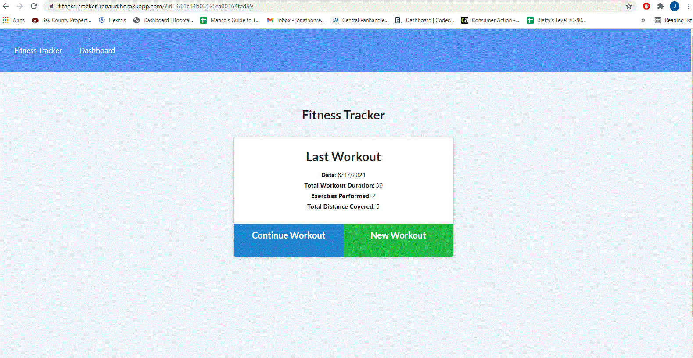

# fitness-tracker

## Description

The purpose of this app was to meet the requirements of the following user story:

As a user, I want to be able to view create and track daily workouts. I want to be able to log multiple exercises in a workout on a given day. I should also be able to track the name, type, weight, sets, reps, and duration of exercise. If the exercise is a cardio exercise, I should be able to track my distance traveled.

  

## Table of Contents 
* [License](#license)
* [Contribution](#contribution)
* [Questions](#questions)
* [Links](#links)
    
## License
This project is licensed under the mit license.
    
## Contribution 
    
Sole Contributor 

If you wish to make contributions, please contact me below, first.

Resources:
GT Unit 18 mini-project
 

## Questions
To contact me or report issues, please email me at jonathonrenaud1988@gmail.com

Go to https://github.com/RoomsieJones to view my github profile.    

## Links
[Link to repository!](https://github.com/roomsiejones/fitness-tracker)

[Link to Deployed Website!](https://fitness-tracker-renaud.herokuapp.com/?id=611c84b03125fa00164fad99)

[LinkedIn](https://www.linkedin.com/in/jonathon-renaud-410910aa/)

[Resume](https://docs.google.com/document/d/1ub28BlsfOwQsW2EZ8ha5-XGSjncabLHVVOhax6jgi4w/edit?usp=sharing)
